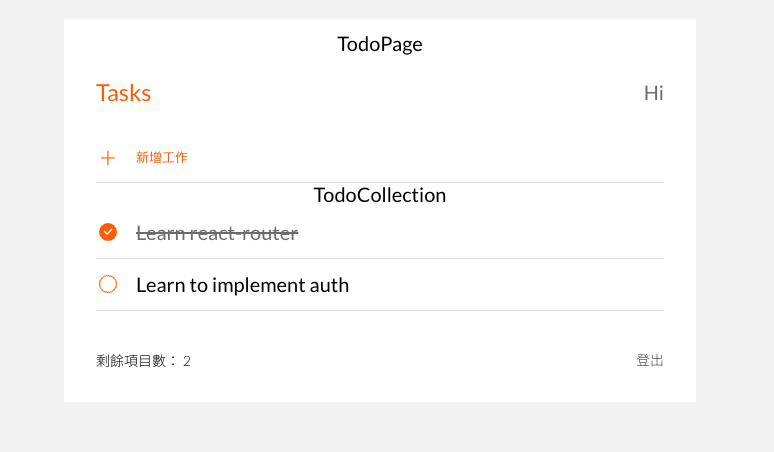

# Todo-List 
- 這是有關CURD Todo-list 的練習

## Features 功能
1.  點選+可新增todo-list
2.  對任務名點兩下可重新編輯任務名
3.  點選X的icon可以刪除該任務
4.  點選圈圈icon可以產生任務完成效果

## prerequisites
- Node.js 14.16.0
- React 18.2.0
- sass 1.56.2

## Install and Execution
1. 確認有無下載Node.js 和 npm
2. 將專案clone到本地
3. 到終端機開啟專案 並輸入 npm install
4. 輸入 npm start
5. 打開瀏覽器輸入http://localhost:3000，便可看到畫面
6. 若想停止到終端機輸入 ctrl + c